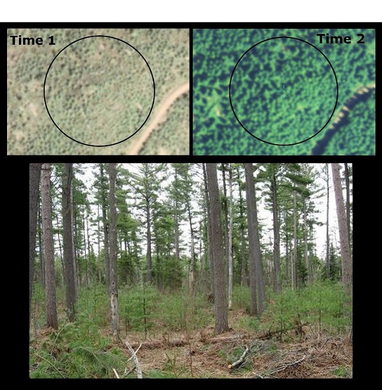

---
output:
  word_document:
    reference_docx: anPBtemplateICE.docx
    fig_caption: yes
  pdf_document: default
params:
  rawfolder: ""
  AOInm: ""
  T1: ""
  T2: ""
  ice.QAQCfn: ""
  outfn.pre: ""
---


```{r inputs, echo=FALSE, warning=FALSE, message=FALSE}
library(FIESTA)


rawfolder <- params$rawfolder
AOInm <- params$AOInm
yearT1 <- params$T1
yearT2 <- params$T2
ice.QAQCfn <- params$ice.QAQCfn
outfn.pre <- params$outfn.pre

if (is.null(rawfolder)) stop()
if (is.null(AOInm)) stop()
if (is.null(yearT1)) stop()
if (is.null(yearT2)) stop()
if (is.null(outfn.pre)) stop()


## Import ICE QAQC data
ice.QAQC <- FIESTA::pcheck.table(ice.QAQCfn)

if (!is.null(ice.QAQC)) {
  if (!all(c("QAQC_check", "Result") %in% names(ice.QAQC))) {
    warning("ice.QAQC table must include QAQC_check and Result columns")
    ice.QAQC <- NULL
  } else {
    check.vals <- c("PC_self_check", "PC_cross_check", "LC1_2_self_check", 
	      "LC1_2_cross_check", "LU1_2_self_check", "LU1_2_cross_check")
    if (!all(check.vals %in% ice.QAQC[["QAQC_check"]])) {
      miss.vals <- check.vals[!check.vals %in% ice.QAQC[["QAQC_check"]]]
      warning("ice.QAQC table must include following values in QAQC_check column: ",
	  toString(miss.vals))
      ice.QAQC <- NULL
    }
  }  
}


#if (is.null(outfolder)) outfolder <- rawfolder
figNum <- 0

## Define variable names in raw tables
use1nm <- "T1-Use"
use2nm <- "T2-Use"
cover1nm <- "T1-Cover"
cover2nm <- "T2-Cover"
agentnm <- "Change Agent-GRP"


```


```{r setup, include=FALSE, echo=FALSE} 

suppressMessages(library(knitr))
suppressMessages(library(pheatmap))


rawfolder <- normalizePath(rawfolder)

#### INPUT 6: Land Use (LU) data for Time 1 (T1: Year 1) #### 
# -------------------------------------------------------------------------------------
Input6 <- list.files(rawfolder, pattern=glob2rx("03*unit.rowest*csv"))
Input6 <- read.csv(file.path(rawfolder, Input6[length(Input6)]), stringsAsFactors=FALSE, check.names=FALSE)

#### INPUT 7: Land Use (LU) data for Time 2 (T2: Year 2) ####
# --------------------------------------------------------------------------------------
Input7 <- list.files(rawfolder, pattern=glob2rx("04*unit.rowest*csv"))
Input7 <- read.csv(file.path(rawfolder, Input7[length(Input7)]), stringsAsFactors=FALSE, check.names=FALSE)

#### INPUT 8: LU net change and uncertainty associated w/ LU net change ####
# -------------------------------------------------------------------------------------
Input8 <- list.files(rawfolder, pattern=glob2rx("09*gainloss*csv"))
Input8 <- read.csv(file.path(rawfolder, Input8[length(Input8)]), stringsAsFactors=FALSE, check.names=FALSE)

#### INPUT 9: LU change decrease or increased, and type of LU that increased/decreased #####
# -----------------------------------------------------------------------------------------------
Input9 <- list.files(rawfolder, pattern=glob2rx("09*unit.grpest*csv"))
Input9 <- read.csv(file.path(rawfolder, Input9[length(Input9)]), stringsAsFactors=FALSE, check.names=FALSE)

#### INPUT 10: Percent of Tree Landcover (LC) ####
# -----------------------------------------------------------------------------------------------
Input10 <- list.files(rawfolder, pattern=glob2rx("05*unit.rowest*csv"))
Input10 <- read.csv(file.path(rawfolder, Input10[length(Input10)]), stringsAsFactors=FALSE, check.names=FALSE)

#### INPUT 11: Percent of Tree Landcover (LC) for T2 (Year 2) ####
# ----------------------------------------------------------------------------------------------
Input11 <- list.files(rawfolder, pattern=glob2rx("06*unit.rowest*csv"))
Input11 <- read.csv(file.path(rawfolder, Input11[length(Input11)]), stringsAsFactors=FALSE, check.names=FALSE)

#### INPUT 12: Tree LC Net Change and Tree LC net change uncertainty ####
# ----------------------------------------------------------------------------------------------
Input12 <- list.files(rawfolder, pattern=glob2rx("10*gainloss*csv"))
Input12 <- read.csv(file.path(rawfolder, Input12[length(Input12)]), stringsAsFactors=FALSE, check.names=FALSE)

#### INPUT 13: Overall tree LC increase or decrease -- What forest changed to for T1 and T2 (year1 and year 2) ####
# ----------------------------------------------------------------------------------------------
Input13 <- list.files(rawfolder, pattern=glob2rx("10*unit.grpest*csv"))
Input13 <- read.csv(file.path(rawfolder, Input13[length(Input13)]), stringsAsFactors=FALSE, check.names=FALSE)

#### Input 14: Net Land use change among all LU classes (Figure 2) 
# ----------------------------------------------------------------------------------------------
Input14 <- list.files(rawfolder, pattern=glob2rx("09*gainloss*csv"))
Input14 <- read.csv(file.path(rawfolder, Input14[length(Input14)]), stringsAsFactors=FALSE, check.names=FALSE)

## Input 15: Forest Land Use Change input (Figure 3) 
# ----------------------------------------------------------------------------------------------
Input15 <- list.files(rawfolder, pattern=glob2rx("07*gainloss*csv"))
Input15 <- read.csv(file.path(rawfolder, Input15[length(Input15)]), stringsAsFactors=FALSE, check.names=FALSE)

## Input 16: Net Land Cover Change Among All Classes (Figure 4)
# ----------------------------------------------------------------------------------------------
Input16 <- list.files(rawfolder, pattern=glob2rx("10*gainloss*csv"))
Input16 <- read.csv(file.path(rawfolder, Input16[length(Input16)]), stringsAsFactors=FALSE, check.names=FALSE)

## Input 17: Forest Land Use Change input (Figure 5) 
# ----------------------------------------------------------------------------------------------
Input17 <- list.files(rawfolder, pattern=glob2rx("08*gainloss*csv"))
Input17 <- read.csv(file.path(rawfolder, Input17[length(Input17)]), stringsAsFactors=FALSE, check.names=FALSE)

## Input 18: Forest Land Use Change input (Figure 6) 
# ----------------------------------------------------------------------------------------------
Input18 <- list.files(rawfolder, pattern=glob2rx("02*unit.rowest*csv"))
Input18 <- read.csv(file.path(rawfolder, Input18[length(Input18)]), stringsAsFactors=FALSE, check.names=FALSE)

## Input 19: Checkerboard figure (Figure 7) 
# ----------------------------------------------------------------------------------------------
Input19 <- list.files(rawfolder, pattern=glob2rx("09*unit.grpest*csv"))
Input19 <- read.csv(file.path(rawfolder, Input19[length(Input19)]), stringsAsFactors=FALSE, check.names=FALSE)

## Input 20: Checkerboard figure (Figure 8) 
# ----------------------------------------------------------------------------------------------
Input20 <- list.files(rawfolder, pattern=glob2rx("10*unit.grpest*csv"))
Input20 <- read.csv(file.path(rawfolder, Input20[length(Input20)]), stringsAsFactors=FALSE, check.names=FALSE)

## Input 20: Checkerboard figure (Figure 8) 
# ----------------------------------------------------------------------------------------------
Input21.n <- list.files(rawfolder, pattern=glob2rx("13a*unit.grpest*csv"))
Input21.n <- read.csv(file.path(rawfolder, Input21.n[length(Input21.n)]), stringsAsFactors=FALSE, check.names=FALSE)

## Input 21: Table Estimated percent of T2-Cover within T2-Use; Vermont 2012-2014 (Figure 9) 
# ----------------------------------------------------------------------------------------------
Input21 <- list.files(dirname(rawfolder), pattern=glob2rx("13a*csv"))
Input21 = read.csv(file.path(dirname(rawfolder), Input21[length(Input21)]), stringsAsFactors=FALSE, 
            skip = 3, nrows = length(unique(Input21.n[[cover2nm]])), check.names=FALSE)


#==========================================================================
# Set some global defaults 
#==========================================================================

#### knitr global chunk options #####

# Set knitr chunk options to be applied throughout document. Prevents user from having to re-write the options in every code "chunk"
# echo = FALSE --- no code shown -- Good for scientific reports when people do not want to see the code 
# Here width and height of all figures is set
# !!!! Can change specific figure dimensions in the figure creation chunks !!!!

#knitr::opts_chunk$set(echo = TRUE)
#--------------------------------------------------------------------------
knitr::opts_chunk$set(fig.width=8)
knitr::opts_chunk$set(fig.height=6)

#==========================================================================
# Figure settings ---- lables, etc. 
#==========================================================================

# Define ICE LU/LC classes and "pretty" labels for use in figures
# ----------------------------------------------------------------

allLUClasses <- Input6[[use1nm]]
allLUClassLabs <- wraptitle(sub("/", "\n", allLUClasses), 8)
nLUClasses = length(allLUClasses)

allLCClasses <- Input10[[cover1nm]]
allLCClassLabs <- wraptitle(sub("/", "\n", allLCClasses), 10)
nLCClasses = length(allLCClasses)

```


```{r customFunc, include=FALSE} 
#=============================================================================
#****************************************************************************#
#### CUSTOM DATA AND PLOT FUNCTIONS ####
#****************************************************************************#
#=============================================================================
#  F  ########################################################################
##  U  #######################################################################
###  N  ######################################################################
####  C  #####################################################################
#####  T  ####################################################################
######  I  ###################################################################
#######  O  ##################################################################
########  N  #################################################################
#########  s  ################################################################

#=============================================================================
#### CUSTOM DATA FUNCTIONS ####
#=============================================================================
# 1. setDecPlaces
# 2. getNPrettyDecPlaces
# 3. getrange


# --> to specify the number of decimal places:
#     * Input(s): number to round, number of decimal places you want in the num
#     * Output(s): the number, w/ specificed n decimal places
setDecPlaces = function(x, k) format(round(x, k), nsmall=k) # x = number, k = num decimal places


# --> to get num "pretty" decimal places that would make a "pretty"-formatted number
#     (basically trailing zeroes trimmed)
#     * Input(s): a number!
#     * Output(s): number of decimal places that would make the number "pretty"
getNPrettyDecPlaces = function(x) {
  nPrettyDecPlaces = 0 # default = whole numbers
  x = as.character(abs(as.numeric(x)))

  fields = unlist(strsplit(x,".",fixed=TRUE)) # trims trailing zeroes by default?
  
  if (length(fields) > 1) { # decimal point was specified; get n decimal places to make num pretty
    nPrettyDecPlaces = nchar(fields[2]) 
  } # wholeNum check 
  
  return(nPrettyDecPlaces)    
} # end function getNPrettyDecPlaces


# --> TF's function to get the extent of a map (ul,ur,ll,lr)
#     Input(s): Extent or matrix 
#     Output(s): coordinates of corners 
getrange <- function(x){
  if(class(x) == "Extent"){
    rng <- c(x@xmin, x@ymin, x@xmax, x@ymax)
  }else if(class(x) == "matrix"){
    rng <- c(x[1,1], x[2,1], x[1,2], x[2,2])
  }else{
    stop("must be class 'Extent' or 'matrix'")
  }

  ul <- rng[c(4,1)]	# (ymax, xmin)
  ur <- rng[c(4,3)]	# (ymax, xmax)
  ll <- rng[c(2,1)]	# (ymin, xmin)
  lr <- rng[c(2,3)]	# (ymin, xmax)
       
  return(list(rng=rng, ul=ul, ur=ur, ll=ll, lr=lr))
}


##********** END of DATA FUNCTIONS ***********************************###
#!!!!!!!!!!!!!!!!!!!!!!!!!!!!!!!!!!!!!!!!!!!!!!!!!!!!!!!!!!!!!!!!!!!!!!!#


#=============================================================================
#### CUSTOM PLOT FUNCTIONS ####
#=============================================================================
# 2. plotNetChangesByClass
# 3. plotGainLossSingClass


#===============================================================================  
## plotNetChangesByClass function:  plot net changes in classes for LU and LC
#===============================================================================  

# Input(s): type of data (LU = Land Use, LC = Land Class), 
#               full path to and filename for input csv, figure title
#     Output(s): bar chart, with net change (gain, loss, no change/0%) for each 
#                LU or LC class, with uncertainty info (diff.CI95left,right)
plotNetChangesByClass = function(datatype='LU',inFile=NULL,figTitle="") {

  if (is.null(inFile)) {
    print(paste0("Provide the full path to and the filename of ",
          "the ICE LU or LC estimates via 'inFile'."))
    quit()
  }

  if (datatype == 'LU') {
    nClasses = nLUClasses
  } else if (datatype == 'LC') {
    nClasses = nLCClasses
  } else {
    print(paste0("Unrecognized ICE type ", datatype,".  Should be 'LU' or 'LC'"))    
    quit()
  }

  # read in data  
  tabInfo = inFile

  # file structure change on 4/9/2018 in estimate files - code around these
  category = unlist(strsplit(tabInfo$gain.val,split=" to "))
  category = category[seq(2,length(category),by=2)] # get only even elements on the right hand side of the "to" equation

  tabInfo = cbind(category, tabInfo)
  
  # set up variables that will be used to make the plot
  barData = as.numeric(nClasses)
  barUncData = as.numeric(nClasses)
  barColors = as.character(nClasses)
  barLabels = as.character(nClasses)
  classLabCol = rep("black",nClasses)
  
  # populate barData, barColors, barLabels
  for (Idx in 1:nClasses) {

    if (datatype == 'LU') {    
    
      if (nrow(tabInfo[tabInfo[,1] == allLUClasses[Idx],]) == 0) {
        barData[Idx] = 0 # assume zero if not present in TF table
        barUncData[Idx] = 0
        barLabels[Idx] = ""
        classLabCol[Idx] = "darkgray" # combo doesn't exist in this AOI
      } else {
        barData[Idx] = tabInfo[tabInfo[,1] == allLUClasses[Idx],]$diff.est

        barUncData[Idx] = tabInfo[tabInfo[,1] == allLUClasses[Idx],]$diff.CI95left
        if (barData[Idx] > 0) {
          barUncData[Idx] = tabInfo[tabInfo[,1] == allLUClasses[Idx],]$diff.CI95right
        }         
        
        if (barData[Idx] == 0) {
          barLabels[Idx] = paste0(setDecPlaces(barData[Idx],0),"%")  
        } else {
          barLabels[Idx] = paste0(setDecPlaces(barData[Idx],3),"%")  
        }

      } # end if/check for non-existent data
      
    } else if (datatype == 'LC') {

      if (nrow(tabInfo[tabInfo[,1] == allLCClasses[Idx],]) == 0) {
        barData[Idx] = 0 # assume zero if not present in TF table
        barUncData[Idx] = 0
        barLabels[Idx] = ""
        classLabCol[Idx] = "darkgray" # combo doesn't exist in this AOI
      } else {
        barData[Idx] = tabInfo[tabInfo[,1] == allLCClasses[Idx],]$diff.est


        barUncData[Idx] = tabInfo[tabInfo[,1] == allLCClasses[Idx],]$diff.CI95left
        if (barData[Idx] > 0) {
          barUncData[Idx] = tabInfo[tabInfo[,1] == allLCClasses[Idx],]$diff.CI95right
        }        
        
        if (barData[Idx] == 0) {
          barLabels[Idx] = paste0(setDecPlaces(barData[Idx],0),"%")  
        } else {
          barLabels[Idx] = paste0(setDecPlaces(barData[Idx],3),"%")  
        }
      } # end if/check for non-existent data

    } # end if/check for LU or LC
    
    barColors[Idx] = "red"
    if (barData[Idx] > 0) {
      barColors[Idx] = "blue"
    } 
  } # end for loop over ALL Classes

  # set up y-axis increments and ticks 
  ymin = min(c(barData,barUncData),na.rm=TRUE)
  ymax = max(c(barData,barUncData),na.rm=TRUE)

  magnitude = max(c(abs(ymin),abs(ymax)))*1.20 # make room for bar labels

  ymin = (-1)*magnitude
  ymax = magnitude

  yticks = pretty(c(ymin,ymax))

  ymin = yticks[1]
  ymax = tail(yticks,n=1)

  # set up plot layout - in this case, 1 panel with room for title at top
  subpanel_coords = matrix(NA,nrow=1,ncol=4) # nrow = nSubPanels
                                             # ncol = L,R,B,T

#  subpanel_coords[1,1] = 0.05
#  subpanel_coords[1,2] = 0.95 
  minHorizSideSpace = 0.05
  addlHorizSideSpace = (14-nClasses)*minHorizSideSpace/2

  subpanel_coords[1,1] = minHorizSideSpace + addlHorizSideSpace
  subpanel_coords[1,2] = 1.0 - minHorizSideSpace - addlHorizSideSpace
  subpanel_coords[1,3] = 0.03
  subpanel_coords[1,4] = 0.80

  invisible(split.screen(subpanel_coords)) # invisible suppresses the "##[1] 1 2" output

  screen(1)
  
  # bottom, left, top, and right
  par(mar=c(3,2,0,0)) # leave space for class names along xaxis and room for % labels 
                      # along yaxis

  # plot the gains and losses for each ICE LU or LC class in a bar graph
  barp = barplot(barData,col = barColors,ylim=c(ymin,ymax), 
                 beside=TRUE,horiz=FALSE,space=0.25,axes=FALSE,
                 xlab="",ylab="",font=1,las=1,ann=FALSE,names.arg=NA)
  
  #write.csv(barp,file=paste0("plotNetChangesByClass_",datatype,".csv"))

  # add uncertainty data (95 CI)
  xcoords = barp[,1]
  par(xpd=NA)
  for (i in 1:length(xcoords)) {
    yLo = min(c(barData[i],barUncData[i]))
    yHi = max(c(barData[i],barUncData[i]))
    lines(x=rep(xcoords[i],2),y=c(yLo,yHi),col='darkgrey',lwd=4)
  }
  
  # add data values as labels at the end of bars.
  labPosn = 1 # below bar by default
  for (i in 1:length(barData)) {
    if (barData[i] < 0) {
      labPosn = 1 # label losses with % loss below the bar
    } else {
      labPosn = 3 # label gains with %gain above the bar
    } # end check for zero/nonzero data value

    text(x=barp[i,1], y=barData[i], labels=barLabels[i], xpd=NA,cex=0.65,pos=labPosn)
  }

  # custom labels and positioning for x-axis
  xcoords = barp[,1]

  par(xpd=NA) # allow plotting/annotation outside figure region

  if (datatype == 'LU') {
    prettyClassLabs = allLUClassLabs
  } else if (datatype == 'LC') {
    prettyClassLabs = allLCClassLabs
  }

  text(x=xcoords,y=ymin-(ymax-ymin)*0.23,cex=0.6,srt=45,labels=prettyClassLabs,col=classLabCol)

  # custom y-axis labels, ticks and overall axis title
  # --> determine max num of decimal places to display
  maxNDecPlaces = 0
  for (ytickIdx in 1:length(yticks)) {
    currN = getNPrettyDecPlaces(yticks[ytickIdx])
    if(currN > maxNDecPlaces) {
      maxNDecPlaces = currN
    }
  } # end for loop over yticks

  par(xpd=NA) # allow plotting/annotation outside figure region
  axis(2,at=yticks,labels=paste0(setDecPlaces(yticks,maxNDecPlaces),"%"),
       las=2,cex.axis=0.9,tck=-0.050,mgp=c(3,0.5,0))

  # add reference lines to plot
  par(xpd=FALSE) # restrict plotting to figure region; otherwise ref. lines will go outside fig region.
  abline(h=yticks,lty="dotted",col="gray")
  abline(h=0,lty="solid",col="black")

  # add barplot a 2nd time, so as to have bars covering up reference lines (cleaner look)
  barp = barplot(barData,col = barColors,ylim=c(ymin,ymax), 
                 beside=TRUE,horiz=FALSE,space=0.25,axes=FALSE,
                 xlab="",ylab="",font=1,las=1,ann=FALSE,names.arg=NA,add=TRUE)

  # add legend to explain that gray line = 95% confidence interval
  par(xpd=NA) # allow drawing outside of box plot area
  legend("topright",
                    legend=c("95% Confidence Interval"),
                    col=c("darkgray"),
                    lty=c("solid"),lwd=3,
                    bty='n',text.col="black",cex=0.8,horiz=TRUE,
                    inset=c(-0.00,-0.15))

  legend("topleft",
                    legend=c("Gain","Loss"),
                    col=c("blue","red"),
                    pch=c(15,15),
                    pt.cex=1.5,x.intersp=1.0,
                    bty='n',text.col="black",cex=0.8,horiz=TRUE,
                    inset=c(0,-0.15))
        
  box()

  # flush out graphics
  close.screen(all.screens=TRUE)

  # add overall figure title
  title(main=figTitle,line=3,cex.main=1.2)
} 


##********** End of plotNetChangesByClass function ***********************************###
#!!!!!!!!!!!!!!!!!!!!!!!!!!!!!!!!!!!!!!!!!!!!!!!!!!!!!!!!!!!!!!!!!!!!!!!!!!!!!!!!!!!!!!!#


#==================================================================================================
# plotGainLossSingClass function: plot gain and loss for a single class of LU or LC
#===================================================================================================
# Input(s): type of data (LU = Land Use, LC = Land Class), 
# Grouping type w/in the dataset (used to determine field from which to pull data)
# Full path to filename for input csv, the class for which we want a bar chart
# Output(s): bar chart, with gains and losses for the class in question (class2Plot)


plotGainLossSingClass = function(datatype='LU',grouping='fine',
                                 inFile=NULL,
                                 class2Plot='Forest') {

  tabInfo = inFile
  
  # file structure change on 4/9/2018 in estimate files - code around these
  category = unlist(strsplit(tabInfo$gain.val,split=" to "))
  category = category[seq(2,length(category),by=2)] # get only even elements on the right hand side of the "to" equation

  tabInfo = cbind(category, tabInfo)

  gainVal = tabInfo[tabInfo[,1] == class2Plot,]$gain.est
  lossVal = (tabInfo[tabInfo[,1] == class2Plot,]$loss.est)*(-1) # loss is reported as + val in TF tables
  
  gainUncVal = tabInfo[tabInfo[,1] == class2Plot,]$gain.CI95right
#  lossUncVal = tabInfo[tabInfo[,1] == class2Plot,]$loss.CI95left
  lossUncVal = tabInfo[tabInfo[,1] == class2Plot,]$loss.CI95right*(-1) # loss CI's are reported as positive in TF tables

  barData = as.numeric(c(gainVal,lossVal))
  barUncData = as.numeric(c(gainUncVal,lossUncVal))

  # set up y-axis increments and ticks
  ymin = min(c(barData,barUncData),na.rm=TRUE)
  ymax = max(c(barData,barUncData),na.rm=TRUE)

  magnitude = max(c(abs(ymin),abs(ymax)))*1.20 # make room for bar labels

  ymin = (-1)*magnitude
  ymax = magnitude

  yticks = pretty(c(ymin,ymax))

  ymin = yticks[1]
  ymax = tail(yticks,n=1)

  # xmin, xmax
  xmin = 0
  xmax = 3
  
  # set up colors
  colorsInRamp = c("blue","red") # blue = gain, red = loss
  colRamp = colorRampPalette(colorsInRamp)

  # bar plot itself
  barp = barplot(barData,col = colRamp(length(barData)),
                 ylim=c(ymin,ymax),beside=TRUE,horiz=FALSE,space=0.25,axes=FALSE,
                 xlab="",font=1,las=1,cex.names=1.1,xlim=c(xmin,xmax))

  # add uncertainty data (95 CI)
  xcoords = barp[,1]
  par(xpd=NA)
  for (i in 1:length(xcoords)) {
    yLo = min(c(barData[i],barUncData[i]))
    yHi = max(c(barData[i],barUncData[i]))
    lines(x=rep(xcoords[i],2),y=c(yLo,yHi),col='darkgrey',lwd=6)
  }
  
  # add data values as labels at the end of bars.
  labPosn = 3 # above bar by default
  for (i in 1:length(barData)) {
    if (barData[i] == 0) { # don't label 0%'s
      barLab = paste0(setDecPlaces(barData[i],0),"%")
    } else {
      barLab = paste0(setDecPlaces(barData[i],3),"%")

      if (barData[i] < 0) {
        labPosn = 1 # label losses with % loss below the bar
      } else {
        labPosn = 3 # label gains with %gain above the bar
      }
    } # end check for zero/nonzero data value

    text(x=barp[i,1], y=barData[i], labels=barLab, xpd=NA,cex=1,pos=labPosn)
  }

  # custom y-axis labels, ticks and overall axis title

  # --> determine max num of decimal places to display
  maxNDecPlaces = 0
  for (ytickIdx in 1:length(yticks)) {
    currN = getNPrettyDecPlaces(yticks[ytickIdx])
  
    if(currN > maxNDecPlaces) {
      maxNDecPlaces = currN
    }
  } 
  par(xpd=NA) # allow plotting/annotation outside figure region
 
  axis(4,at=yticks,labels=paste0(setDecPlaces(yticks,maxNDecPlaces),"%"),
       las=2,cex.axis=0.9,tck=-0.050,mgp=c(3,0.5,0))

  # add reference lines to plot
  par(xpd=FALSE) # restrict plotting to figure region; otherwise ref. lines will go outside fig region.
  abline(h=yticks,lty="dotted",col="gray")
  abline(h=0,lty="solid",col="black")

  
  # add barplot a 2nd time, so as to have bars covering up reference lines (cleaner look)
  barp = barplot(barData,col = colRamp(length(barData)),
                 ylim=c(ymin,ymax),beside=TRUE,horiz=FALSE,space=0.25,axes=FALSE,
                 xlab="",font=1,las=1,cex.names=1.1,xlim=c(xmin,xmax),add=TRUE)
 
  # add legend to explain that gray line = 95% confidence interval
  par(xpd=NA) # allow drawing outside of box plot area
  legend("top",legend=c("95% Conf. Interval"),col="darkgray",lty="solid",lwd=3,
      bty='n',text.col="black",cex=0.6,ncol=1,inset=c(-0.08,-0.08),xjust=1)
  
  legend("top",
         legend=c("Gain","Loss"),
         col=c("blue","red"),
         pch=c(15,15),
         pt.cex=1.5,x.intersp=1.0,
         bty='n',text.col="black",cex=0.8,horiz=TRUE,
         inset=c(-0.08,-0.15))
   
  # add a "b" in lower left corner of bar graph for reference
  bX = xmin + (xmax-xmin)*0.0001
  bY = ymin + (ymax-ymin)*0.05
  
  # text(x=bX,y=bY,labels="b", cex = 1.4)
  
  box()
} 


##********** End of plotGainLossSingClass function ***********************************###
#!!!!!!!!!!!!!!!!!!!!!!!!!!!!!!!!!!!!!!!!!!!!!!!!!!!!!!!!!!!!!!!!!!!!!!!!!!!!!!!!!!!!!!!#


##********* Checkerboard function ***************************************************###
#!!!!!!!!!!!!!!!!!!!!!!!!!!!!!!!!!!!!!!!!!!!!!!!!!!!!!!!!!!!!!!!!!!!!!!!!!!!!!!!!!!!!!!#

plotCheckerboard = function(datatype='LU',inFile,
                            use1nm, use2nm, cover1nm, cover2nm,
                            allClasses=as.character(0),
                            allClassesPretty=as.character(0),
                            cellWidth=NA,cellHeight=NA) {

  if (invisible(is.null(inFile))) {
    print("missing args - Need a data file, with full path")
    quit()
  }  

  if (length(allClasses) == 0) { 
    print("missing args - need a vector of class names")
    quit()
  }
  
  if (length(allClassesPretty) == 0) { 
    print("missing args - need a vector of pretty class names for labeling rows & columns")
    quit()
  }    

  if (is.na(cellWidth)) {
    print("missing args - need a user-defined cell width")
    quit()
  } 

  if (is.na(cellHeight)) {
    print("missing args - need a user-defined cell height")
    quit()
  } 

  tabInfo = inFile

  nClasses = length(allClasses)

  xmax = cellWidth*(nClasses+1.5)
  ymax = cellHeight*(nClasses+1.5)

  #par(mar = c(0, 5, 0, 0)+.1) # leave room for T1 and T2 Class Names at left and top
  
  # set up grid of rectangles that will be colored by gain/loss
  plot(xmax,ymax,typ='n',xlim=c(0,xmax),ylim=c(0,ymax),xaxt='n',yaxt='n',
       ann=FALSE,bty='n')

  for (T1Idx in 1:nClasses) {
    T1 = allClasses[T1Idx]

    for (T2Idx in 1:nClasses) {
      T2 = allClasses[T2Idx]

      # figure out rectangle vertices for this cell
      rectXCoord = c(T2Idx-1,T2Idx,T2Idx,T2Idx-1)*cellWidth
      rectYCoord = c((nClasses+1)-T1Idx,
                     (nClasses+1)-T1Idx,
                     (nClasses+1)-T1Idx+1,
                     (nClasses+1)-T1Idx+1)*cellHeight 

      # add label to rectangle.      
      labX = mean(c(T2Idx-1,T2Idx))
      labY = mean(c((nClasses+1)-T1Idx,
                    (nClasses+1)-T1Idx+1))

      if (datatype == 'LU') { 
        estStr = tabInfo[tabInfo[[use1nm]] == T1 & tabInfo[[use2nm]] == T2,]$est
        seStr = tabInfo[tabInfo[[use1nm]] == T1 & tabInfo[[use2nm]] == T2,]$est.se
        yaxTitle = "Land Use"
      } else if (datatype == 'LC') {
        estStr = tabInfo[tabInfo[[cover1nm]] == T1 & tabInfo[[cover2nm]] == T2,]$est
        seStr = tabInfo[tabInfo[[cover1nm]] == T1 & tabInfo[[cover2nm]] == T2,]$est.se
        yaxTitle = "Land Cover"
      } else {
        print("you said datatype != LU and datatype != LC... need to specify datatype = LU or LC")
        quit()
      }  

      if (length(estStr) != 1) {
        estStr = NA
      }
    
      if (length(seStr) != 1) {
        seStr = NA
      }
      # defaults
      cellLabel = ""  
      rectColor="white"
      drawRect = FALSE

      # T1/T2 combo not found in TF table for this AOI
      if (is.na(estStr) & is.na(seStr)) { 
        rectColor = "white"
        cellLabel = ""
   
        drawRect = TRUE
      } 

      # persistence on the diagonal of the matrix
      if (T1Idx == T2Idx & !(is.na(estStr) & is.na(seStr)) ) { 
        rectColor = "gray"
        cellLabel = paste0(setDecPlaces(estStr,2),"%\n",
                          "(",setDecPlaces(seStr,2),"%)")
      
        drawRect = TRUE
      } 

      # change occurred - plot orange cell 
      if (T1Idx != T2Idx & !(is.na(estStr) & is.na(seStr))) { 
        rectColor = "orange"
        cellLabel = paste0(setDecPlaces(estStr,2),"%\n",
                          "(",setDecPlaces(seStr,2),"%)")
        drawRect = TRUE
      } 

      if (drawRect) {
        polygon(x=rectXCoord,y=rectYCoord,col=rectColor) 
        text(x=labX,y=labY,labels=cellLabel,col="black",cex=0.8)
      }
    
      # Add T1 class name to left of grid
      if ((T2Idx %% nClasses) == 1) {

        if(datatype=='LU') { # note to self: need to scale these values by nClasses
          xLabOffset = 1
        } else { # LC
          xLabOffset = 1.5
        }
        
        xcoord = labX - xLabOffset 
        ycoord = labY

        par(xpd=NA)      
        text(x=xcoord,y=ycoord,labels=allClassesPretty[T1Idx],col="black",cex=0.9)

        # left side title
        if (T1Idx == 1 && T2Idx == 1) {
          text(x=xcoord,y=ycoord+0.75,labels=paste0("T1 ",yaxTitle),col="black",font=2)     
        }
      } # end if/write T1 class names along left of grid

      # Add T2 class name along top of grid
      if ((T1Idx %% nClasses) == 1) {

        if(datatype=='LU') { # note to self: need to scale these values by nClasses
          xLabOffset = 0.2
          yLabOffset = 1.5
        } else { # LC
          xLabOffset = 0.1
          yLabOffset = 1.5
        }
        
        xcoord = labX + xLabOffset
        ycoord = labY + yLabOffset

        par(xpd=NA)      
        text(x=xcoord,y=ycoord,labels=allClassesPretty[T2Idx],col="black",cex=0.9,srt=45)

        # top side title
        if (T1Idx == 1 && T2Idx == 1) {

          if (datatype=='LU') { # note to self: need to scale these values by nClasses
            yLabOffset = 1
          } else { # LC
            yLabOffset = 1
          }
          
          text(x=xcoord,y=ycoord+yLabOffset,labels=paste0("T2 ",yaxTitle),col="black",font=2)     
        }
      } # end if/write T1 class names along left of grid   
            
    } # end for loop over T2
  } # end for loop over T1

  par(xpd=NA) # allow drawing outside of figure region itself.

  legend("topright",
         legend=c("Persistence","Change\nOccurred",
                  paste0("Change\nCombination\nNot Present in\n",AOInm)),
         pt.cex=1.5,fill=c("gray","orange","white"), cex=1, bty='n', bg="white",
         inset=c(-0.05,0.05),y.intersp=1.4) 
} 


######################## Second plot #####################################################

plotCheckerboard2 = function(datatype='LU',inFile,
                            use1nm, use2nm, cover1nm, cover2nm,
                            allClasses=as.character(0),
                            allClassesPretty=as.character(0),
                            cellWidth=NA,cellHeight=NA) {

  if (invisible(is.null(inFile))) {
    print("missing args - Need a data file, with full path")
    quit()
  }  

  if (length(allClasses) == 0) { 
    print("missing args - need a vector of class names")
    quit()
  }
  
  if (length(allClassesPretty) == 0) { 
    print("missing args - need a vector of pretty class names for labeling rows & columns")
    quit()
  }    

  if (is.na(cellWidth)) {
    print("missing args - need a user-defined cell width")
    quit()
  } 

  if (is.na(cellHeight)) {
    print("missing args - need a user-defined cell height")
    quit()
  } 

  tabInfo = inFile

  nClasses = length(allClasses)

  xmax = cellWidth*(nClasses+1.5)
  ymax = cellHeight*(nClasses+1.5)

  #par(mar = c(0, 5, 0, 0)+.1) # leave room for T1 and T2 Class Names at left and top
  
  # set up grid of rectangles that will be colored by gain/loss
  plot(xmax,ymax,typ='n',xlim=c(0,xmax),ylim=c(0,ymax),xaxt='n',yaxt='n',
       ann=FALSE,bty='n')

  for (T1Idx in 1:nClasses) {
    T1 = allClasses[T1Idx]

    for (T2Idx in 1:nClasses) {
      T2 = allClasses[T2Idx]

      # figure out rectangle vertices for this cell
      rectXCoord = c(T2Idx-1,T2Idx,T2Idx,T2Idx-1)*cellWidth
      rectYCoord = c((nClasses+1)-T1Idx,
                     (nClasses+1)-T1Idx,
                     (nClasses+1)-T1Idx+1,
                     (nClasses+1)-T1Idx+1)*cellHeight 

      # add label to rectangle.      
      labX = mean(c(T2Idx-1,T2Idx))
      labY = mean(c((nClasses+1)-T1Idx,
                    (nClasses+1)-T1Idx+1))

      if (datatype == 'LU') { 
        estStr = tabInfo[tabInfo[[use1nm]] == T1 & tabInfo[[use2nm]] == T2,]$est
        seStr = tabInfo[tabInfo[[use1nm]] == T1 & tabInfo[[use2nm]] == T2,]$est.se
        yaxTitle = "Land Use"
      } else if (datatype == 'LC') {
        estStr = tabInfo[tabInfo[[cover1nm]] == T1 & tabInfo[[cover2nm]] == T2,]$est
        seStr = tabInfo[tabInfo[[cover1nm]] == T1 & tabInfo[[cover2nm]] == T2,]$est.se
        yaxTitle = "Land Cover"
      } else {
        print("you said datatype != LU and datatype != LC... need to specify datatype = LU or LC")
        quit()
      }  

      if (length(estStr) != 1) {
        estStr = NA
      }
    
      if (length(seStr) != 1) {
        seStr = NA
      }
      # defaults
      cellLabel = ""  
      rectColor="white"
      drawRect = FALSE

      # T1/T2 combo not found in TF table for this AOI
      if (is.na(estStr) & is.na(seStr)) { 
        rectColor = "white"
        cellLabel = ""
   
        drawRect = TRUE
      } 

      # persistence on the diagonal of the matrix
      if (T1Idx == T2Idx & !(is.na(estStr) & is.na(seStr)) ) { 
        rectColor = "gray"
        cellLabel = paste0(setDecPlaces(estStr,2),"%\n",
                          "(",setDecPlaces(seStr,2),"%)")
      
        drawRect = TRUE
      } 

      # change occurred - plot orange cell 
      if (T1Idx != T2Idx & !(is.na(estStr) & is.na(seStr))) { 
        rectColor = "orange"
        cellLabel = paste0(setDecPlaces(estStr,2),"%\n",
                          "(",setDecPlaces(seStr,2),"%)")
        drawRect = TRUE
      } 

      if (drawRect) {
        polygon(x=rectXCoord,y=rectYCoord,col=rectColor) 
        text(x=labX,y=labY,labels=cellLabel,col="black",cex=0.8)
      }
    
      # Add T1 class name to left of grid
      if ((T2Idx %% nClasses) == 1) {

        if(datatype=='LU') { # note to self: need to scale these values by nClasses
          xLabOffset = 2
        } else { # LC
          xLabOffset = 1.6
        }
        
        xcoord = labX - xLabOffset 
        ycoord = labY

        par(xpd=NA)      
        text(x=xcoord,y=ycoord,labels=allClassesPretty[T1Idx],col="black",cex=0.9)

        # left side title
        if (T1Idx == 1 && T2Idx == 1) {
          text(x=xcoord,y=ycoord+0.75,labels=paste0("T1 ",yaxTitle),col="black",font=2)     
        }
      } # end if/write T1 class names along left of grid

      # Add T2 class name along top of grid
      if ((T1Idx %% nClasses) == 1) {

        if(datatype=='LU') { # note to self: need to scale these values by nClasses
          xLabOffset = 0
          yLabOffset = 2
        } else { # LC
          xLabOffset = 0.1
          yLabOffset = 1.5
        }
        
        xcoord = labX + xLabOffset
        ycoord = labY + yLabOffset

        par(xpd=NA)      
        text(x=xcoord,y=ycoord,labels=allClassesPretty[T2Idx],col="black",cex=0.9,srt=90)

        # top side title
        if (T1Idx == 1 && T2Idx == 1) {

          if (datatype=='LU') { # note to self: need to scale these values by nClasses
            yLabOffset = 1
          } else { # LC
            yLabOffset = 1
          }
          
          text(x=xcoord,y=ycoord+yLabOffset,labels=paste0("T2 ",yaxTitle),col="black",font=2)     
        }
      } # end if/write T1 class names along left of grid   
            
    } # end for loop over T2
  } # end for loop over T1

  par(xpd=NA) # allow drawing outside of figure region itself.

  legend("topright",
         legend=c("Persistence","Change\nOccurred",
                  paste0("Change\nCombination\nNot Present in\n",AOInm)),
         pt.cex=1.5,fill=c("gray","orange","white"), cex=1, bty='n', bg="white",
         inset=c(-0.05,0.05),y.intersp=1.4) 
} 


###### End of plotCheckerboard function ##################################################  


##********** END OF PLOT FUNCTIONS ***************************************************###
#!!!!!!!!!!!!!!!!!!!!!!!!!!!!!!!!!!!!!!!!!!!!!!!!!!!!!!!!!!!!!!!!!!!!!!!!!!!!!!!!!!!!!!!#


#=========================================================================================================
###### Everything below is adding text, data to plots using functions created above ######################
# The above code are custom data and plot functions 
# Below we fill in plots using the functions above with FIA input data, and with the addition of plot text
#=========================================================================================================

```


```{r getSummaryInfo,echo=FALSE,include=TRUE}

#===================================================================================================================
# Forest LU and Tree LC summary: This chunk is specific to forest LU and LC. Other LU summary info is in next chunks
#===================================================================================================================

# --------------------------------------------------------------------------------
#  * estimate for AOI for T1
#  *   + uncertainty info
#  * estimate for AOI for T2
#  *   + uncertainty info
#  * direction of T1 --> T2 change (decrease or increase)
#  * wording to describe the change in classes from T1 to T2, depending on whether it was incr. or decr.


### Create an empty dataframe and fields to populate (summaryInfo dataframe) 
## The following code populates the fields created below in the summaryInfo dataframe 
# -------------------------------------------------------------------------------------
summaryInfo = as.data.frame(matrix(nrow=1,ncol=18))
names(summaryInfo) = c("forLuEstT1",
                       "forLuUncT1",
                       "forLuEstT2",
                       "forLuUncT2",
                       "forLuAmtChange",
                       "forLuAmtChangeUnc",
                       "forLuDecrIncr",
                       "forLuClassDescT1",
                       "forLuClassDescT2",
                       "treeLcEstT1",
                       "treeLcUncT1",
                       "treeLcEstT2",
                       "treeLcUncT2",
                       "treeLcAmtChange",
                       "treeLcAmtChangeUnc",
                       "treeLcDecrIncr",
                       "treeLcClassDescT1",
                       "treeLcClassDescT2")


## INPUT 6: Time 1 Land Use estimation and uncertainty 
# -------------------------------------------------------------------------------------
summaryInfo[1,]$forLuEstT1 = Input6[Input6[[use1nm]] == "Forest",]$est
summaryInfo[1,]$forLuUncT1 = Input6[Input6[[use1nm]]== "Forest",]$est.se


## INPUT 7: Time 2 Land Use estimation and uncertainty 
# -------------------------------------------------------------------------------------
summaryInfo[1,]$forLuEstT2 = Input7[Input7[[use2nm]] == "Forest",]$est
summaryInfo[1,]$forLuUncT2 = Input7[Input7[[use2nm]] == "Forest",]$est.se


## INPUT 8: LU net change and uncertainty associated w/ LU net change
# The LU net change value goes in figure 3 box plot
# This value goes into Figure 3 boxplot Forest LU loss/gain --- see Notes concerning question about this
# ------------------------------------------------------------------------------------------
category = unlist(strsplit(Input8$gain.val,split=" to "))
category = category[seq(2,length(category),by=2)] # get only even elements on the right hand side of the "to" equation

Input8 = cbind(category, Input8)

summaryInfo[1,]$forLuAmtChange = Input8[Input8[,1] == 'Forest',]$diff.est
summaryInfo[1,]$forLuAmtChangeUnc = Input8[Input8[,1] == 'Forest',]$diff.se


## INPUT 9: Determines if LU change decrease or increased based on forLuAmtChange field value in SummaryInfo table
# Change in LU between two years is populated into "forLuDecrIncr" field
# The type of LU class that changed is populated into "forLuClassDescT1/T2" fields 
# Forest land use is row one, hence index [1,]
# -----------------------------------------------------------------------------------------------

if (summaryInfo[1,]$forLuAmtChange == 0) {
  summaryInfo[1,]$forLuDecrIncr = "did not change"
  summaryInfo[1,]$forLuClassDescT1 = NA
  summaryInfo[1,]$forLuClassDescT2 = NA

} else if (summaryInfo[1,]$forLuAmtChange < 0) {

  summaryInfo[1,]$forLuDecrIncr = "decreased"
  summaryInfo[1,]$forLuClassDescT1 = 'Forest'

  # figure out what Forest changed to; leave out any T1=0/T2=0 (never present) combos
  classesT2 = Input9[Input9[[use1nm]] == 'Forest' & 
                      Input9[[use2nm]] != 'Forest' &
                      Input9$est != 0,][[use2nm]]

  # build string to describe what Forest changed to
  if (length(classesT2) == 1) {
    classesT2Str = classesT2[1]
  } else if (length(classesT2) == 2) {
    classesT2Str = paste0(classesT2[1]," and ",classesT2[2])
  } else { # > 2 
   
    classesT2Str = classesT2[1]
    for (i in 2:(length(classesT2)-1)) {
      classesT2Str = paste0(classesT2Str,", ",classesT2[i])
    }
    classesT2Str = paste0(classesT2Str,", and ",classesT2[length(classesT2)])
    
    summaryInfo[1,]$forLuClassDescT2 = classesT2Str

  } # end if/building string to describe what Forest changed to
  
} else { # if (summaryInfo[1,]$forLuAmtChange > 0) {

  summaryInfo[1,]$forLuDecrIncr = "increased"
  summaryInfo[1,]$forLuClassDescT2 = 'Forest'

  # figure out what classes changed from somethign else to Forest
  classesT1 = Input9[Input9$use_2_nm == 'Forest' & 
                      Input9$use_1_nm != 'Forest' &
                      Input9$est != 0,]$use_1_nm

  # build string to describe what Forest changed to
  if (length(classesT1) == 1) {
    classesT1Str = classesT1[1]
  } else if (length(classesT1) == 2) {
    classesT1Str = paste0(classesT1[1]," and ",classesT1[2])
  } else { # > 2 
   
    classesT1Str = ""
    for (i in 1:(length(classesT1)-1)) {
      classesT1Str = paste0(classesT1Str,",")
    }

    classesT1Str = paste0(classesT1Str," and ",classesT1[length(classesT1)])
    
    summaryInfo[1,]$forLuClassDescT1 = classesT1Str
  } # end if/building string to describe what classes changed to Forest
} # end if/determine if Forest increased, decreased or stayed the same. 

if (summaryInfo[1,]$forLuAmtChange == 0) {
  forLuChgStmt = ""
  forLuChgStmt1 = ""
} else { # there was change
  forLuChgStmt = paste0("by ",setDecPlaces(summaryInfo[1,]$forLuAmtChange,3),"%  (+/-",
                              setDecPlaces(summaryInfo[1,]$forLuAmtChangeUnc,3),"%)",
                   " due to conversion of lands from ",
                   summaryInfo[1,]$forLuClassDescT1," to ",
                   summaryInfo[1,]$forLuClassDescT2)

  forLuChgStmt1 = paste0(
                   "This change was due to conversion of lands from ",
                   summaryInfo[1,]$forLuClassDescT1," to ",
                   summaryInfo[1,]$forLuClassDescT2," LU.")
} # end if/define Forest LU change statement


## INPUT 10: Percent of Tree Landcover (LC) for T1 (Year 1)
# ----------------------------------------------------------------------------------------------
summaryInfo[1,]$treeLcEstT1 = Input10[Input10[[cover1nm]] == "Tree - Live",]$est
summaryInfo[1,]$treeLcUncT1 = Input10[Input10[[cover1nm]] == "Tree - Live",]$est.se


## INPUT 11: Percent of Tree Landcover (LC) for T2 (Year 2)
# ----------------------------------------------------------------------------------------------
summaryInfo[1,]$treeLcEstT2 = Input11[Input11[[cover2nm]] == "Tree - Live",]$est
summaryInfo[1,]$treeLcUncT2 = Input11[Input11[[cover2nm]] == "Tree - Live",]$est.se


## INPUT 12: Tree LC Net Change and Tree LC net change uncertainty 
# Difference between "treeLcEstT1" field (year 1) and "treeLcEstT2" (year 2): Year 1 - Year 2 = percent change in tree LC
# ----------------------------------------------------------------------------------------------

category = unlist(strsplit(Input12$gain.val,split=" to "))
category = category[seq(2,length(category),by=2)] # get only even elements on the right hand side of the "to" equation

Input12 = cbind(category, Input12)

summaryInfo[1,]$treeLcAmtChange = Input12[Input12[,1] == 'Tree - Live',]$diff.est
summaryInfo[1,]$treeLcAmtChangeUnc = Input12[Input12[,1] == 'Tree - Live',]$diff.se


## INPUT 13: Overall tree LC increase or decrease -- What forest changed to for T1 and T2 (year1 and year 2) 
# ----------------------------------------------------------------------------------------------

if (summaryInfo[1,]$treeLcAmtChange == 0) {
  summaryInfo[1,]$treeLcDecrIncr = "did not change"
  summaryInfo[1,]$treeLcClassDescT1 = NA
  summaryInfo[1,]$treeLcClassDescT2 = NA

} else if (summaryInfo[1,]$treeLcAmtChange < 0) {

  summaryInfo[1,]$treeLcDecrIncr = "decreased"
  summaryInfo[1,]$treeLcClassDescT1 = 'Tree'

  # figure out what Tree LC changed to; leave out any T1=0/T2=0 (never present) combos
  classesT2 = Input13[Input13[[cover1nm]] == 'Tree - Live' & 
                      Input13[[cover2nm]] != 'Tree - Live' &
                      Input13$est != 0,][[cover2nm]]

  # build string to describe what Tree changed to
  if (length(classesT2) == 1) {
    classesT2Str = classesT2[1]
  } else if (length(classesT2) == 2) {
    classesT2Str = paste0(classesT2[1]," and ",classesT2[2])
  } else { # > 2 
   
    classesT2Str = classesT2[1]
    for (i in 2:(length(classesT2)-1)) {
      classesT2Str = paste0(classesT2Str,", ",classesT2[i])
    }
    classesT2Str = paste0(classesT2Str,", and ",classesT2[length(classesT2)])
    
    summaryInfo[1,]$treeLcClassDescT2 = classesT2Str

  } # end if/building string to describe what Forest changed to
  
} else { # if (summaryInfo[1,]$treeLcAmtChange > 0) {

  summaryInfo[1,]$treeLcDecrIncr = "increased"
  summaryInfo[1,]$treeLcClassDescT2 = 'Tree'

  # figure out what classes changed from somethign else to Tree
  classesT1 = Input13[Input13$cover_2_nm == 'Tree - Live' & 
                      Input13$cover_1_nm != 'Tree - Live' &
                      Input13$est != 0,]$cover_1_nm

  # build string to describe what Tree changed to
  if (length(classesT1) == 1) {
    classesT1Str = classesT1[1]
  } else if (length(classesT1) == 2) {
    classesT1Str = paste0(classesT1[1]," and ",classesT1[2])
  } else { # > 2 
   
    classesT1Str = ""
    for (i in 1:(length(classesT1)-1)) {
      classesT1Str = paste0(classesT1Str,",")
    }

    classesT1Str = paste0(classesT1Str," and ",classesT1[length(classesT1)])
    
    summaryInfo[1,]$forLuClassDescT1 = classesT1Str
  } # end if/building string to describe what classes changed to Tree
} # end if/determine if Tree increased, decreased or stayed the same. 

if (summaryInfo[1,]$treeLcAmtChange == 0) {
  treeLcChgStmt1 = ""
} else { # there was change

  treeLcChgStmt1 = paste0(
                   "This change was due to conversion of lands from ",
                   summaryInfo[1,]$treeLcClassDescT1," to ",
                   summaryInfo[1,]$treeLcClassDescT2," LC.")
} # end if/define Tree LC change statement


```


```{r getInput21,echo=FALSE,include=FALSE}

## Input 21: T2 Cover heatmap setup 

d = data.frame(Input21[,-1],row.names = Input21[,1])

## Convert to matrix for heat map 
d = as.matrix(d, replace=TRUE)

## Round values to first decimal 
mat = round(as.numeric(d),1)

```


---
title: "Image-based Change Estimation (ICE) Summary for `r AOInm`, `r yearT1` to `r yearT2`"
---

&nbsp;
&nbsp; 

__Date:__ `r format(Sys.time(), "%B %d, %Y")`

&nbsp;
&nbsp;

The Image-based Change Estimation (ICE) program allows FIA to quickly create information about LU and LC composition and the causes of landscape changes. The ICE protocol is a relatively quick and simple, image-based approach of producing reliable estimates of LC and LU change for a population. Data are collected using multi-date image interpretation (Fig. 1). The plot design used for this project consists of a plot center and a 144-foot radius plot.

&nbsp;

`r figNum=0`

############### 

``` {r iceOverviewGraphicCapGen,include=FALSE, fig.height=2,fig.width=8}
#===================================================================================================================
# Figure 1 caption and text created here 
#===================================================================================================================


figNum = figNum+1
figCap = paste0("Figure ",figNum,": High resolution imagery from two time periods (top) ",
                                   "is used to quantify the type(s) of change occurring on ",
                                   "the ground (bottom).  In this case, forest management ",
                                   "practices have cleared the understory to allow seedlings to emerge.")
```
########## `r figCap`

ICE data for Land Use (LU), Land Cover (LC), and Agent of Change were collected for the population of `r AOInm`, on all lands.  To determine and analyze LU, LC, and Agent of Change for `r AOInm`, National Agriculture Imagery Program (NAIP) imagery was interpreted from `r yearT1` and `r yearT2`.

&nbsp;
&nbsp;


Over the analysis period (`r yearT1` to `r yearT2`), Forest LU in `r AOInm` `r summaryInfo[1,]$forLuDecrIncr` by `r paste0(abs(as.numeric(setDecPlaces(summaryInfo[1,]$forLuAmtChange,3))),"% (+/-",setDecPlaces(summaryInfo[1,]$forLuAmtChangeUnc,4),"%)")`, from `r paste0(setDecPlaces(summaryInfo[1,]$forLuEstT1,3),"%")` (+/-`r paste0(setDecPlaces(summaryInfo[1,]$forLuUncT1,4),"%")`) in `r yearT1` to `r paste0(setDecPlaces(summaryInfo[1,]$forLuEstT2,3),"%")` (+/-`r paste0(setDecPlaces(summaryInfo[1,]$forLuUncT2,4),"%")`) in `r yearT2`. `r forLuChgStmt1`

&nbsp; 
&nbsp;

Tree LC in `r AOInm` `r summaryInfo[1,]$treeLcDecrIncr` over the analysis period by `r paste0(abs(as.numeric(setDecPlaces(summaryInfo[1,]$treeLcAmtChange,3))),"% (+/-",setDecPlaces(summaryInfo[1,]$treeLcAmtChangeUnc,4),"%)")`, from `r paste0(setDecPlaces(summaryInfo[1,]$treeLcEstT1,3),"%")` (+/-`r paste0(setDecPlaces(summaryInfo[1,]$treeLcUncT1,4),"%")`) in `r yearT1` to `r paste0(setDecPlaces(summaryInfo[1,]$treeLcEstT2,3),"%")` (+/-`r paste0(setDecPlaces(summaryInfo[1,]$treeLcUncT2,4),"%")`) in `r yearT2`. `r treeLcChgStmt1`


################ Estimated Land Use Changes for `r AOInm` between `r yearT1` and `r yearT2` among all Land Use Classes
&nbsp;
````{r luCheckerboard,echo=FALSE,fig.height=8,fig.width=11.5, dpi=300}


#===================================================================================================================
# Figure 7 - Checkerboard 1 
#===================================================================================================================


##titleStr = paste0("Estimated Land Use Changes for ", AOInm,
               ## " Between ",yearT1," and ",yearT2,",\nAmong All Land Use Classes")


# set up layout to accommodate grid itself + T1 and T2 class names/labels
# set up multi-paneled plot layout
subpanel_coords = matrix(NA,nrow=1,ncol=4) # nrow = nSubPanels
                                           # ncol = L,R,B,T
# subpanel #1
subpanel_coords[1,1] = 0.05
subpanel_coords[1,2] = 0.95 
subpanel_coords[1,3] = 0.0
subpanel_coords[1,4] = 0.9


invisible(split.screen(subpanel_coords))

# subpanel #1 - checkerboard itself (only 1 panel in this graphic)
screen(1)

par(mar = c(0, 5, 0, 0))


par(oma = c(0, 0, 0, 0))


object = plotCheckerboard2(datatype='LU',inFile=Input19,
                 use1nm=use1nm, use2nm=use2nm,
                 cover1nm=cover1nm, cover2nm=cover2nm,
                 allClasses = allLUClasses,
                 allClassesPretty = allLUClassLabs,
                 cellWidth=1,cellHeight=1)
 
##axis(1,pos=1)
##axis(2,pos=1)


# close up subpanel screens
close.screen(all = TRUE)

# add overall figure title
##title(main=titleStr,line=0,cex.main=1.5)

````


```` {r luCheckerboardCapGen,include=FALSE}
figNum = figNum + 1
figCap = paste0("Figure ",figNum,": Estimated Land Use Change for ", AOInm," from ",
                 yearT1," to ", yearT2, ", with standard error values in parentheses.")


````
########## `r figCap`


############ 
################ Agent of Change for `r AOInm` (`r yearT1` to `r yearT2`)

``` {r chgAgBarChart,echo=FALSE, fig.height=3}

#===================================================================================================================
# Figure 6 - Percent of Area Changed, by Agent of Change -- This part adds in caption text &
# plots data using plotGainLossSingClass function created above 
#===================================================================================================================

## Input 18: Forest Land Use Change input (Figure 6) 

# Don't include "No Change"
tabInfo = Input18[Input18[[agentnm]] != 'No Change',]

barData = as.numeric(tabInfo$est)
barLabels = tabInfo[[agentnm]]

# replace "Stress" with "Stress and Mortality" on the y axis labels
barLabels[barLabels == 'Stress'] = 'Stress and Mortality'

# set xticks to accommodate CIs, which extend beyond the bars themselves 
xLeft = min(tabInfo$CI95left,na.rm=TRUE)
if (min(tabInfo$CI95left,na.rm=TRUE) < 0) {
  xLeft = 0
}

xticks = pretty(c(xLeft,
                max(tabInfo$CI95right,na.rm=TRUE))) 

xmin = xticks[1] 
xmax = tail(xticks,n=1)

# set color ramp
colorsInRamp = c("darkgray","white")
colRamp = colorRampPalette(colorsInRamp)

# add bar plot to graphic, with margins to accommodate labels and titles.
# bottom, left, top, and right
par(mar=c(3,9,3,1))
barp = barplot(rev(barData),col = rev(colRamp(length(barData))),xlim=c(xmin,xmax),
               beside=FALSE,horiz=TRUE,
               space=0.25,axes=FALSE,
               xlab="",names.arg=rev(barLabels),font=1,las=1,cex.names=0.8)

# add 95% confidence intervals
ycoords = rev(barp[,1])
par(xpd=NA)
for (i in 1:length(ycoords)) {
#  xLeft = max(0,tabInfo$CI95left[i])
  xLeft = max(0,barData[i])
  lines(x=c(xLeft,tabInfo$CI95right[i]),y=rep(ycoords[i],2))
}

# add reference lines
par(xpd=FALSE)
abline(v=xticks,lty="dotted",col="gray")

# add legend to explain that black line = 95% confidence interval
par(xpd=NA) # allow drawing outside of box plot area
legend("topright",legend=c("95% Confidence Interval"),col="black",lty="solid",
      bty='n',text.col="black",cex=0.8,ncol=1,inset=c(0.00,-0.25))

# add x-axis ticks and labels
axis(1,at=xticks,labels=paste0(setDecPlaces(xticks,1)," %"))

# add y-axis title
#axis(2,at=median(ycoords),labels=c("Agent of Change"),
#     las=3,cex.axis=1.2,font=2,mgp=c(3,7,0),tick=FALSE) # default mgp = 3,1,0

# Add Main title.
par(xpd=FALSE)
##mtext(text=paste0("Percent of Area Changed, by Agent of Change"),
      ##side=3,line=2,font=2,cex=1.5)

box()
```

``` {r aocCapGen,include=FALSE}  
figNum = figNum + 1
figCap = paste0("Figure ",figNum,": Estimated percent area of ", AOInm,
                 " that changed between ",yearT1," and ",yearT2,
                 " by Agent of Change, on all lands.")
                 
```
########## `r figCap`


############
################ Land Use for `r AOInm` (`r yearT1` to `r yearT2`)
&nbsp;
&nbsp;
``` {r luNetChange,echo=FALSE,fig.height=3,dpi=300}

#===================================================================================================================
# Figures 2 - are created from plot frameworks, and functions called above &
# plots data using plotNetChangesByClass function created above 
#===================================================================================================================


#===================================================================================================================
# Figure 2 - Net Land Use Change Among All Classes 
#===================================================================================================================

## Input 14: Net Land use change among all LU classes (Figure 2) 

# Figure 2 title 
titleStr=paste0("Net Land Use Change Among All Classes")

## plotNetChangesByClass function created above in non-forest function section 
plotNetChangesByClass(datatype='LU',inFile=Input14,figTitle=titleStr)
```

``` {r luNetChangeCapGen,include=FALSE}


# Figure 2 caption text  

figNum = figNum+1
figCap = paste0("Figure ",figNum,": Estimated percent net land use change for ",
                 AOInm, " for all classes from ",yearT1," to ",yearT2,".  ",
                "Class names in gray text were not captured by the sample in ", AOInm,".")
```
########## `r figCap`
 


``` {r luForGainLoss_tab3,echo=FALSE,fig.height=4,dpi=300}

#===================================================================================================================
# Figure 3 - Forest Land Use Change -- Title added, open map added &
# plots data using plotGainLossSingClass function created above 
#===================================================================================================================

## Input 15: Forest Land Use Change input (Figure 3) 


# Figure 3 title 
titleStr=paste("Forest Land Use Change")

# set up multi-paneled plot layout
subpanel_coords = matrix(NA,nrow=3,ncol=4) # nrow = nSubPanels
                                           # ncol = L,R,B,T
# subpanel #1
subpanel_coords[1,1] = 0.2
subpanel_coords[1,2] = 0.8 
subpanel_coords[1,3] = 0.03
subpanel_coords[1,4] = 0.95
invisible(split.screen(subpanel_coords)) 

# --> subpanel #2: plot bar graph
screen(1)

# bottom, left, top, and right
par(mar = c(0, 0, 4, 2))

plotGainLossSingClass(datatype='LU',grouping='fine',
                      inFile=Input15,
                      class2Plot='Forest') # maybe coarse???

# flush out graphics
close.screen(all.screens=TRUE)

# add overall figure title
title(main=titleStr,line=1.5,cex.main=1.2)
```

``` {r luForestGainLossCapGen,include=FALSE}

#===================================================================================================================
# Figure 3 - Forest Land Use Change cont'd -- This part adds in caption text 
#===================================================================================================================


figNum = figNum+1
figCap = paste0("Figure ",figNum,": Estimated percent of ", AOInm,"'s area that experienced Forest LU Gain (left bar) and Loss                 (right bar) between ",yearT1," and ",yearT2,".  " )

```
########## `r figCap`

############ 
################ Land Cover for `r AOInm` (`r yearT1` to `r yearT2`)
&nbsp;
&nbsp;
``` {r lcNetChange,echo=FALSE,fig.height=3,dpi=300}

#===================================================================================================================
# Figure 4 - Net Land Cover Change Among All Classes -- This part adds in caption text & 
# plots data using plotNetChangesByClass function created above  
#===================================================================================================================

## Input 16: Forest Land Use Change input (Figure 4) 

titleStr=paste0("Net Land Cover Change Among All Classes")


plotNetChangesByClass(datatype='LC',inFile=Input16,figTitle=titleStr)
```
``` {r lcNetChangeCapGen,include=FALSE}
figNum = figNum+1
figCap = paste0("Figure ",figNum,": Estimated percent net land cover change for ",
                 AOInm, " for all classes from ",yearT1," to ",yearT2,".  ",
                "Class names in gray text were not captured by the sample in ", AOInm,".")
```
########## `r figCap`


``` {r lcTreeGainLoss,echo=FALSE, fig.height=4,dpi=300}

#===================================================================================================================
# Figure 5 - Tree Land Cover Change -- This part adds in caption text &
# plots data using plotGainLossSingClass function created above 
#===================================================================================================================

## Input 17: Forest Land Use Change input (Figure 5) 

titleStr=paste("Tree Land Cover Change")

# set up multi-paneled plot layout
subpanel_coords = matrix(NA,nrow=3,ncol=4) # nrow = nSubPanels
                                           # ncol = L,R,B,T
subpanel_coords[1,1] = 0.2
subpanel_coords[1,2] = 0.8 
subpanel_coords[1,3] = 0.03
subpanel_coords[1,4] = 0.95
invisible(split.screen(subpanel_coords))

# --> subpanel #2: plot bar graph
screen(1)

# bottom, left, top, and right
par(mar = c(0, 0, 4, 2))

plotGainLossSingClass(datatype='LC',inFile=Input17,
                      grouping='coarse',
                      class2Plot='Tree')

# flush out graphics
close.screen(all.screens=TRUE)

# add overall figure title
title(main=titleStr,line=1.5,cex.main=1.2)
```

``` {r lcTreeGainLossCapGen,include=FALSE}

#===================================================================================================================
# Figure 5 - Forest Land Use Change -- This part adds in caption text & 
#===================================================================================================================

figNum = figNum+1
figCap = paste0("Figure ",figNum,
                ": Estimated percent of ", AOInm,"'s area that experienced Tree LC Gain (left bar) and Loss (right bar) between                 ",yearT1," and ",yearT2,".  ")
                
```
########## `r figCap`


\newpage


################ Estimated Land Cover changes for `r AOInm` between `r yearT1` and `r yearT2` among all Land Cover Classes

```{r lcCheckerboard,echo=FALSE,fig.height=7,fig.width=11.5,dpi=300}

#===================================================================================================================
# Figure 8 - Checkerboard 2 
#===================================================================================================================


# set up layout to accommodate grid itself + T1 and T2 class names/labels
# set up multi-paneled plot layout
subpanel_coords = matrix(NA,nrow=1,ncol=4) # nrow = nSubPanels
                                           # ncol = L,R,B,T
# subpanel #1
subpanel_coords[1,1] = 0.0 
subpanel_coords[1,2] = 0.95 
subpanel_coords[1,3] = 0.0
subpanel_coords[1,4] = 0.87
invisible(split.screen(subpanel_coords))

# subpanel #1 - checkerboard itself (only 1 panel in this graphic)
screen(1)

## bottom, left, top, and right
par(mar = c(0, 5, 0, 0))

plotCheckerboard(datatype='LC',inFile=Input20,
                 use1nm=use1nm, use2nm=use2nm, 
                 cover1nm=cover1nm, cover2nm=cover2nm,
                 allClasses = allLCClasses,
                 allClassesPretty = allLCClassLabs,
                 cellWidth=1,cellHeight=1)

# close up subpanel screens
close.screen(all = TRUE)

# add overall figure title
#title(main=titleStr,line=.6,cex.main=1.5)
```

``` {r lcCheckerboardCapGen,include=FALSE}
figNum = figNum + 1
figCap = paste0("Figure ",figNum,": Estimated Land Cover change for ", AOInm," ", yearT1," to ", yearT2, ", with standard error values in parentheses.")
#                "  (Data file: ",basename(dataFile),")")
```
########## `r figCap`


``` {r T2LUCapGen,include=FALSE}
figNum = figNum + 1
figCap = paste0("Figure ",figNum,": The percent of ", AOInm,
                 " landcover that correspond to different land uses between ",yearT1," and ",yearT2,
                 ". Lighter shaded cells represent higher percentage of landcover that correspond to a given",
                 " land use.")
```

########## `r figCap`

\newpage

############
############## Quality Assessment and Quality Control (QAQC) report

&nbsp;

A Quality Assessment and Quality Control (QAQC) report was generated for `r AOInm` for `r yearT1` to `r yearT2` that compares agreement between original photo interpretations and blind re-interpretations by the same interpreter on the same plot (self checks), and also to blind interpretations made by another interpreter on the same plots (cross checks). The results are outlined below.

&nbsp;

  - For Presence of Change, agreement was `r paste0(ice.QAQC[ice.QAQC$QAQC_check == 'PC_self_check'][["Result"]], "%")` in self checks and `r paste0(ice.QAQC[ice.QAQC$QAQC_check == 'PC_cross_check'][["Result"]], "%")` in cross checks.
  - For Land Cover 1 and 2, agreement was `r paste0(ice.QAQC[ice.QAQC$QAQC_check == 'LC1_2_self_check'][["Result"]], "%")` in self checks and `r paste0(ice.QAQC[ice.QAQC$QAQC_check == 'LC1_2_cross_check'][["Result"]], "%")` in cross checks.
  - For Land Use 1 and 2, agreement was `r paste0(ice.QAQC[ice.QAQC$QAQC_check == 'LU1_2_self_check'][["Result"]], "%")` in self checks and `r paste0(ice.QAQC[ice.QAQC$QAQC_check == 'LU1_2_cross_check'][["Result"]], "%")` in cross checks.
  - For Change Agent, agreement was `r paste0(ice.QAQC[ice.QAQC$QAQC_check == 'CA_self_check'][["Result"]], "%")` in self checks and `r paste0(ice.QAQC[ice.QAQC$QAQC_check == 'CA_cross_check'][["Result"]], "%")` in cross checks.

&nbsp;

For more information on the QAQC analysis, reference ICE_`r outfn.pre`_`r yearT1`_`r yearT2`_QAQC.xlsx


##############
############## Reference Information

## Glossary

&nbsp;
&nbsp;

_Agent of Change:_ Interpreted for each point that experienced change between the assessed time periods. Note: seasonal and expected changes, such as Crop Rotation and High Water, may be collected by interpreters but are not included in the change estimates reported.

&nbsp;
&nbsp;

_Land Cover (LC):_ Assessed at each of the sample points to determine what type of cover is present at the sample point. No MMU is required for LC.

&nbsp;
&nbsp;

_Land Use (LU):_ Assessed at each of the sample points to determine what type of use is present. For LU, a minimum mapping unit (MMU) of 1.0 acres in size and greater than 120 feet wide must be met in order for select LUs to be recorded for each point.

&nbsp;
&nbsp;

## References

&nbsp;
&nbsp;

Bechtold, William A.; Patterson, Paul L.; [Editors] 2005. The enhanced forest inventory and analysis program - national sampling design and estimation procedures. Gen. Tech. Rep. SRS-80. Asheville, NC: U.S. Department of Agriculture, Forest Service, Southern Research Station. 85 p.  

&nbsp;
&nbsp;

Patterson, Paul L. 2012. Photo-based estimators for the Nevada photo-based inventory. Res. Pap. RMRS-RP-92. Fort Collins, CO: U.S. Department of Agriculture, Forest Service, Rocky Mountain Research Station. 14 p.

&nbsp;
&nbsp;

U.S. Department of Agriculture, Forest Service. 2016. Image-based Change Estimation (ICE) Protocol Guide, Version 3, 19 p. Unpublished protocol guide on file at: Geospatial Technology and Applications Center, Salt Lake City, Utah. 


